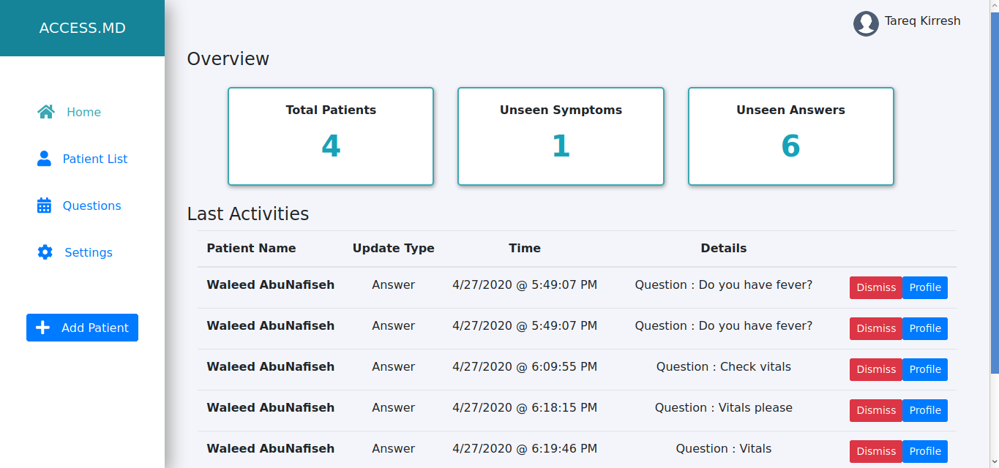
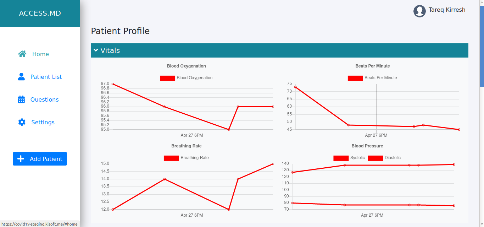
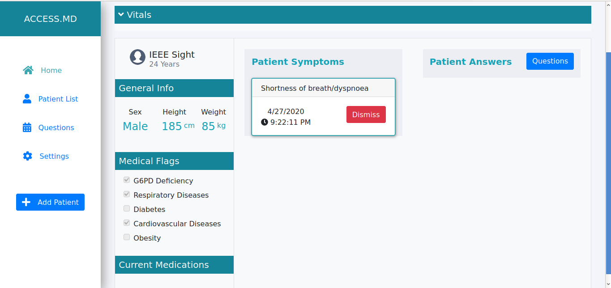

# ACCESS.MD

 

ACCESS.MD is a mobile and web app to allow medical providers to get their IT infrastructure up and running at minimal cost and complication.

We started the ACCESS.MD project at the onset of our local covid-19 outbreak. Our initial target was to create an easy-to-deploy and self host community-local Telemedicine app for healthcare providers that do not have infrastructure to follow up with remote patients so they dont leave home.

Uses code from [HealthWatcher](https://github.com/YahyaOdeh/HealthWatcher) for Vitals Measurement and Reporting.

## Features

* Full Patient Complaint and Response History 
* Patient Medical Profile & History 
* 2-Way MD and patient communication using questions system
  * Schedueled Questions
  * Patient Complaints
  * MD Replies
  * Vitals Measurement & Graphing Using IR imagery from smartphones
* Push Notifications for Patient and Doctor
* Easy Dashboard for Multiple Patient Management
* Fully ICPC-2 compliant Medical Record
  
# Links 

* [Project Page and Documentation](https://wiki.kisoft.me/doku.php?id=projects:access_md:start)
* [UI Design Guidelines](https://wiki.kisoft.me/doku.php?id=projects:access_md:design_specifications:design_guidelines)
* [General Implementation Guidelines](https://wiki.kisoft.me/doku.php?id=projects:access_md:design_specifications:application_architecture)
* [Sequence Diagrams & Other Designs](https://wiki.kisoft.me/doku.php?id=projects:access_md:design_specifications:sequence_diagram)
* [Meeting Minutes](https://wiki.kisoft.me/doku.php?id=projects:access_md:meeting_minutes:start)

# Contributors

Made with [contributors-img](https://contributors-img.web.app).

# Screen Shots

## Dashboard

## Vitals 

## Patient Profile

